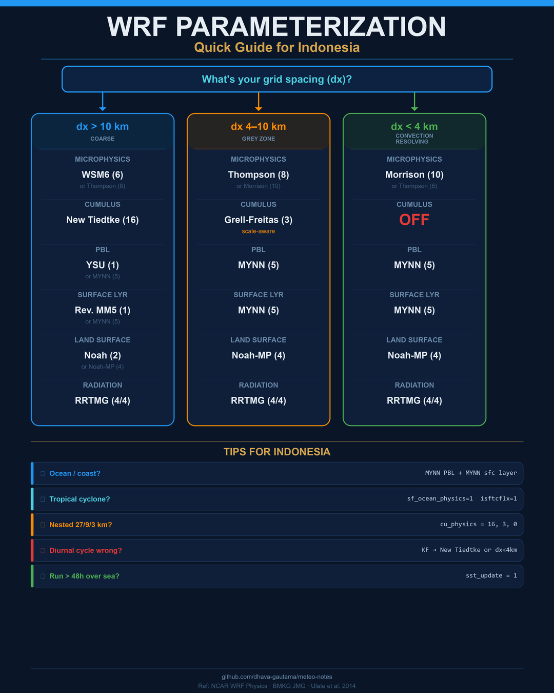

# WRF Parameterization Guide

Personal notes on WRF physics options — written so that someone picking up WRF for the first time can actually make sense of the namelist without drowning in jargon. Focused on what works for Indonesia and tropical domains.

Ref: [NCAR Physics References](https://www2.mmm.ucar.edu/wrf/users/physics/phys_references.html)

---

## Table of Contents

1. [So What Even Is Parameterization?](#1-so-what-even-is-parameterization)
2. [Microphysics (mp_physics)](#2-microphysics-mp_physics)
3. [Cumulus (cu_physics)](#3-cumulus-cu_physics)
4. [Boundary Layer / PBL (bl_pbl_physics)](#4-boundary-layer--pbl-bl_pbl_physics)
5. [Surface Layer (sf_sfclay_physics)](#5-surface-layer-sf_sfclay_physics)
6. [Land Surface (sf_surface_physics)](#6-land-surface-sf_surface_physics)
7. [Radiation (ra_lw_physics / ra_sw_physics)](#7-radiation-ra_lw_physics--ra_sw_physics)
8. [Other Stuff Worth Knowing](#8-other-stuff-worth-knowing)
9. [Configs I'd Use for Indonesia](#9-configs-id-use-for-indonesia)
10. [The NCAR Tropical Suite (Shortcut)](#10-the-ncar-tropical-suite-shortcut)
11. [Mistakes I've Seen (and Made)](#11-mistakes-ive-seen-and-made)
12. [Quick Decision Guide](#12-quick-decision-guide)

---

## 1. So What Even Is Parameterization?

WRF chops the atmosphere into grid boxes — say, 10 km wide and a few hundred meters tall. Anything that happens at a scale *smaller* than that box can't be directly simulated. You need a formula to approximate its effect. That formula is the parameterization.

Think of it this way: if your grid is 10 km, and a thunderstorm is 10 km wide, the whole storm sits inside one box. The model has no idea there's a thunderstorm in there unless you tell it to check for one — that's what the cumulus scheme does.

Same idea applies to cloud droplets (billions of them in one box), turbulent eddies (meters to hundreds of meters, way below grid scale), radiation (photon-by-photon transfer isn't feasible), and soil/vegetation processes.

The important thing to remember: **as you increase resolution, some things stop needing parameterization.** The big one is convection — below ~4 km grid spacing, thunderstorms are actually resolved by the grid, so you *turn off* the cumulus scheme. More on that later.

---

## 2. Microphysics (`mp_physics`)

This handles what happens inside clouds: vapor condensing into droplets, droplets colliding and growing into rain, ice crystals forming, snow aggregating, graupel/hail forming. It runs at every grid point regardless of resolution.

### Background: moments and classes

**Classes** just means how many types of water/ice the scheme tracks:
- 3-class: vapor + cloud water + rain. Warm rain only, no ice. Basically useless for real weather.
- 5-class: adds ice crystals and snow.
- 6-class: adds graupel (dense icy particles). This is the minimum you want for convective weather.
- 7-class: separates hail from graupel.

**Single-moment** schemes only predict the *mass* of each class. They assume a fixed drop size distribution — basically "given X grams of rain per cubic meter, the drops are distributed like this." It's cheaper to compute but the drop sizes can't evolve.

**Double-moment** schemes predict *both* mass and number concentration. So now the model knows whether there are lots of tiny drops or a few fat ones. This matters a lot for rain rates — and especially in the tropics where warm-rain collision-coalescence processes (big drops eating small drops) dominate.

### The schemes

| # | Name | Moments | Classes | Notes |
|---|---|---|---|---|
| 1 | Kessler | Single | 3 | The original textbook scheme. No ice at all. Only useful for idealized experiments or coursework. Don't use this for actual forecasting. |
| 2 | Purdue Lin | Single | 6 | Old but fast. Fixed droplet sizes. If you just need precipitation to show up and don't care much about accuracy, it works. |
| 3 | WSM3 | Single | 3 | Kessler + a crude ice process (below 0°C, cloud water becomes ice). Still too simple. |
| 4 | WSM5 | Single | 5 | Better — has separate ice and snow. But no graupel, so heavy convective rain will be underestimated. |
| 5 | Eta (Ferrier) | Single | mixed | NCEP's old operational scheme. Tracks total condensate rather than individual species. Fast, but a bit of a black box. |
| 6 | **WSM6** | Single | 6 | The workhorse. Adds graupel, decent ice processes. Good speed-accuracy balance. Part of the NCAR Tropical Suite. **Start here if you're a student.** |
| 7 | Goddard | Single | 6 | NASA's scheme. Similar to WSM6 in capability but different ice physics. Shows up a lot in tropical and coupled modeling papers. |
| 8 | **Thompson** | Hybrid | 6 | Double-moment for rain and ice, single-moment for the rest. Probably the most popular scheme worldwide right now. Well-validated across many weather regimes. Works well pretty much everywhere. |
| 9 | Milbrandt-Yau | Double | 7 | Full double-moment including hail. Expensive. Mainly for severe storm research. |
| 10 | **Morrison** | Double | 6 | Full double-moment for everything. The go-to scheme for convection-permitting research (dx < 4 km). If you're running high-res and want to do it right, this is it. |
| 11 | CAM 5.1 | Double | 5 | From NCAR's climate model. Meant for climate runs, not weather. |
| 14 | WDM5 | Double | 5 | Double-moment WSM5. No graupel though. |
| 16 | **WDM6** | Double | 6 | Double-moment WSM6. A nice middle ground — familiar WSM6 structure but with prognostic droplet number. Good for tropical convection without going full Morrison. |
| 17–21 | NSSL variants | Double | 6–7 | Built for severe storms (supercells, tornadoes, hail). In WRF v4.6+, just use `mp_physics=18` and toggle features with `nssl_*` flags. |
| 24 | WSM7 | Single | 7 | WSM6 + separate hail. When you want hail but don't want double-moment cost. |
| 26 | WDM7 | Double | 7 | Double-moment with hail. |
| 28 | Thompson Aerosol-Aware | Hybrid | 6 | Thompson but with prognostic aerosol. More pollution → more small droplets → different rainfall. Good for WRF-Chem or air quality studies. |
| 50–53 | **P3** | Predicted properties | Flexible | This is the new-school approach. Instead of fixed categories (snow vs. graupel vs. hail), each ice particle carries its own properties (mass, rime fraction, density). No more artificial "snow converts to graupel" thresholds. Really elegant, but still newer and less widely tested. |
| 55 | Jensen ISHMAEL | Predicted | Flexible | Similar idea to P3, also tracks ice crystal shape (plates vs. columns). Niche but interesting for ice cloud research. |
| 56 | NTU | Double | 6 | National Taiwan University. Tuned for East Asian and tropical convection. Worth watching. |

### What I'd pick for Indonesia

**Learning/assignments:** WSM6 (6). It's simple, it's documented everywhere, and it's in the Tropical Suite.

**Better results:** Thompson (8) or WDM6 (16). The double-moment rain really helps with tropical maritime convection. Indonesian rainfall is heavily warm-rain driven (collision-coalescence in those fat tropical cumulus towers), and single-moment schemes tend to get the rain rates wrong.

**Serious research at high-res:** Morrison (10). Community standard for convection-permitting work.

---

## 3. Cumulus (`cu_physics`)

This is probably the single most important choice for tropical simulations. It controls how the model represents thunderstorms and deep convection that the grid can't resolve.

### The one rule you absolutely must know

| Grid spacing | Cumulus scheme |
|---|---|
| dx > 10 km | **ON** — the model can't see thunderstorms, needs help |
| dx = 4–10 km | Grey zone — tricky, use scale-aware or turn off |
| dx < 4 km | **OFF** (`cu_physics = 0`) — storms are resolved explicitly |

If you leave a cumulus scheme on at 3 km resolution, you get double-counting: the model resolves the storm *and* the parameterization adds its own version on top. Result: way too much rain. I've seen people get 200+ mm rainfall over Jakarta in a 6-hour forecast because of this.

### How they work — two approaches

**Mass-flux schemes** (most of them): Picture a hot updraft column punching through the atmosphere. The scheme figures out how much air goes up, how much comes back down, how much water condenses and falls out, and how the surrounding air responds (subsidence warming, drying). It needs a "trigger" — usually something like "CAPE exceeds X" or "there's enough low-level convergence."

**Adjustment schemes** (BMJ): Different philosophy. It looks at the temperature and moisture profile and says "this looks like it wants to convect." Then it nudges the profile toward what you'd expect *after* a storm has already happened. Less physics, more empiricism.

### The schemes

| # | Name | Type | What you need to know |
|---|---|---|---|
| 0 | **Off** | — | Required below ~4 km. The model handles convection on its own. |
| 1 | **Kain-Fritsch (KF)** | Mass-flux | Everybody's first cumulus scheme. CAPE-based trigger, removes CAPE over a relaxation timescale. Does both deep and shallow. Works great in mid-latitudes. **But** it tends to fire too aggressively in the tropics — the maritime atmosphere is so warm and moist that KF thinks everything should convect, producing too much rain with the wrong timing. If you're over Indonesia with KF and your rainfall is terrible, this is probably why. |
| 2 | **Betts-Miller-Janjic (BMJ)** | Adjustment | Produces more gentle, widespread rain instead of intense localized bursts. Good for tropical cyclones. Some people find it underestimates heavy convective events, but for large-scale tropical rainfall patterns it works nicely. |
| 3 | **Grell-Freitas (GF)** | Mass-flux, scale-aware | This is the one I'd recommend for nested runs. It's **scale-aware**, meaning it automatically backs off as your grid gets finer. So you can use it on a 9 km domain (grey zone) and it'll do the right thing — no need to manually switch schemes between nests. Also runs an internal ensemble of different closure assumptions for robustness. |
| 5 | Grell-3D | Mass-flux, ensemble | Older Grell without scale-awareness. Still around, but GF (3) is strictly better. |
| 6 | Tiedtke | Mass-flux | Originally from ECMWF. Uses moisture convergence to trigger — which is more physically relevant in the tropics than CAPE thresholds, because tropical convection is often driven by low-level convergence (sea breezes, ITCZ, land-sea contrasts). Handles deep + shallow + mid-level convection separately. |
| 7 | Zhang-McFarlane | Mass-flux | From NCAR's global climate model. CAPE-based. Designed for GCM-scale, not really for regional WRF. |
| 10 | KF-CuP | Mass-flux | KF with cumulus-radiation coupling. Sub-grid cumulus clouds interact with the radiation scheme. Useful for solar energy forecasting. |
| 11 | Multi-scale KF | Mass-flux, scale-aware | KF with some scale-awareness added. An alternative to GF in the grey zone, but GF is more mature. |
| 14 | New SAS | Mass-flux | Simplified Arakawa-Schubert, used in GFS. CAPE-based with deep and shallow components. |
| 16 | **New Tiedtke** | Mass-flux | Updated Tiedtke with better CAPE closure and improved detrainment. **Part of the NCAR Tropical Suite.** Handles the diurnal cycle of convection better than the old version. For the Maritime Continent, where afternoon convection over land and nighttime propagation offshore is a big deal, this matters. |
| 84 | HWRF SAS | Mass-flux | Tuned specifically for hurricane intensity in NOAA's HWRF. |
| 93 | Grell-Devenyi | Mass-flux, ensemble | Predecessor to GF. Not scale-aware. Use GF (3) instead. |

### For Indonesia specifically

**Go-to choices:**
1. **New Tiedtke (16)** — it's in the Tropical Suite for a reason. The moisture-convergence trigger is a natural fit for maritime convection.
2. **Grell-Freitas (3)** — the best option if you're nesting (e.g., 27 km outer, 9 km middle, 3 km inner). Handles the scale transition gracefully.
3. **BMJ (2)** — works well for TC studies and gives decent large-scale tropical rainfall.

**Be careful with:**
- **KF (1)** over Indonesia. It just fires too much. If you must use it, set `kfeta_trigger = 2` (moisture-advection trigger) — it helps reduce the false alarms.

**The diurnal cycle problem:** Over islands like Java, Sumatra, and Kalimantan, convection has a very distinct daily rhythm — heating triggers storms in the afternoon over land, then they propagate offshore at night. Many cumulus schemes get this wrong (especially KF). New Tiedtke and BMJ tend to handle it better, but honestly, none of them nail it perfectly at coarse resolution. Going convection-permitting (dx < 4 km, `cu_physics = 0`) is the real fix.

---

## 4. Boundary Layer / PBL (`bl_pbl_physics`)

The PBL is the bottom ~1–2 km of the atmosphere — the part that directly responds to the surface. During the day, solar heating creates turbulent eddies that mix heat, moisture, and momentum vertically. At night, the surface cools and the PBL stabilizes. The PBL scheme parameterizes all this turbulent mixing.

### Two schools of thought

**Non-local** (YSU and friends): Big eddies in the convective boundary layer can carry air from the surface to the PBL top in one shot. These schemes add a "counter-gradient" correction that allows mixing across the entire PBL depth, not just between neighboring model levels. Think of it as stirring a pot with a big spoon — one stir mixes everything.

**Local / TKE** (MYJ, MYNN, BouLac): Mixing only happens between adjacent levels, driven by local shear and buoyancy. The scheme carries a prognostic TKE (turbulence kinetic energy) variable that tells you how turbulent each level is. More conservative — tends to produce shallower, more stratified boundary layers. Works better for stable conditions (nighttime, over ocean) and marine environments.

### The schemes

| # | Name | Type | Pair with `sf_sfclay` | What's it good for |
|---|---|---|---|---|
| 1 | **YSU** | Non-local | 1 (Rev. MM5) | The default everyone starts with. Yonsei University scheme. Produces well-mixed daytime boundary layers. Simple, reliable, well-documented. Good over land in clear-sky conditions. Part of the Tropical Suite. |
| 2 | **MYJ** | Local, TKE | 2 (Eta) | Mellor-Yamada-Janjic Level 2.5. Heritage from NAM/Eta. Shallower PBLs than YSU. Required if you want to use the multi-layer urban schemes (BEP/BEM). Better for stable/nocturnal conditions. |
| 4 | QNSE | Local, TKE | 4 | Quasi-Normal Scale Elimination. Meant for stable boundary layers (arctic, nighttime). Not common for tropical work. |
| 5 | **MYNN-EDMF** | Local, TKE + mass-flux | 5 (MYNN) | This one's been gaining ground as the new recommended default. Mellor-Yamada-Nakanishi-Niino with an added mass-flux component that handles shallow convection internally. Really good for marine environments, fog, low clouds, and coastal circulations. **For Indonesia, where most of the domain is ocean or coastline, this is probably the best pick.** |
| 7 | ACM2 | Hybrid | 7 (Pleim-Xiu) | Non-local upward, local downward. Specifically for EPA's air quality modeling chain (CMAQ). |
| 8 | BouLac | Local, TKE | 1 or 2 | Bougeault-Lacarrere. The mixing length accounts for terrain geometry. If you're simulating over Java's volcanic peaks or the Papua highlands, this scheme knows about the terrain influence on turbulence. Worth considering for complex-terrain domains. |
| 11 | Shin-Hong | Non-local, scale-aware | 1 | Scale-aware YSU for the sub-km grey zone (LES-like). |
| 12 | GBM | Local, TKE | 1 | Grenier-Bretherton-McCaa. For marine stratocumulus. |

### PBL–surface layer pairing

This trips people up. Each PBL scheme **requires** a specific surface layer scheme. If you mix them, the model will run but the surface fluxes will be inconsistent — you'll get wrong temperatures and winds near the surface.

| PBL | Surface layer it needs |
|---|---|
| YSU (1) | Revised MM5 (1) |
| MYJ (2) | Eta Similarity (2) |
| MYNN (5) | MYNN (5) |
| ACM2 (7) | Pleim-Xiu (7) |
| BouLac (8) | Revised MM5 (1) or Eta (2) |

### For Indonesia

**Best bet:** MYNN-EDMF (5). Indonesia is mostly ocean and coastline. MYNN handles marine boundary layers, sea breeze circulations, and low-level clouds much better than YSU. The built-in shallow convection component is a bonus — you don't need a separate shallow cumulus scheme.

**Also fine:** YSU (1) if your domain is land-dominated (e.g., just Java) or if you want to match the Tropical Suite.

**For mountainous domains:** BouLac (8) — the terrain-aware mixing length is relevant for Java's volcanoes or Papua's central highlands.

---

## 5. Surface Layer (`sf_sfclay_physics`)

This handles the lowest ~10–100 m — the thin layer right above the ground or ocean surface. It calculates how efficiently heat, moisture, and momentum move between the surface and the atmosphere (the "exchange coefficients"). All schemes are based on Monin-Obukhov similarity theory.

Honestly, you mostly just pick whatever matches your PBL scheme (see pairing table above). But a few things worth noting:

| # | Name | Notes |
|---|---|---|
| 1 | **Revised MM5** | Standard choice. Pairs with YSU. Includes a viscous sub-layer. Good all-around. |
| 2 | **Eta Similarity** | Pairs with MYJ. Janjic's version. More conservative (lower fluxes in strong instability). |
| 5 | **MYNN** | Pairs with MYNN PBL. Better roughness length formulation over water — uses Charnock + viscous sub-layer. **Better over ocean/coast.** If your domain is mostly water (which for Indonesia it often is), this matters. |
| 7 | **Pleim-Xiu** | Pairs with ACM2. Air quality stuff. |
| 91 | **Old MM5** | Legacy. No viscous sub-layer. Don't use this for new work — it's only still there for backwards compatibility. (Annoyingly, the Tropical Suite uses this one. I'd override it.) |

**For tropical cyclones:** Set `isftcflx = 1` to modify exchange coefficients at high wind speeds (> 30 m/s). It reduces drag and increases enthalpy flux, which lets simulated TCs get stronger — closer to reality.

---

## 6. Land Surface (`sf_surface_physics`)

This is everything happening at the ground: soil temperature, soil moisture, evapotranspiration, snow, and the surface energy budget. It provides the lower boundary condition for the atmosphere.

| # | Name | Soil Layers | What to know |
|---|---|---|---|
| 1 | 5-layer Thermal Diffusion | 5 | Just diffuses heat through the soil. No vegetation, no soil moisture evolution, no evapotranspiration. Honestly, it's barely a land surface model. Only for debugging or idealized runs. |
| 2 | **Noah** | 4 | The standard. Soil temp + moisture, snowpack, canopy water, evapotranspiration via Penman. Used operationally at NCEP. Part of the Tropical Suite. Does the job. |
| 3 | RUC | 6–9 | More soil layers, multi-layer snow. Designed for mid-latitude winter weather. Not really tuned for the tropics. |
| 4 | **Noah-MP** | 4 | The upgraded Noah. Key difference: it has a **separate vegetation canopy** — plants are treated as a layer above the soil, not just a property of the surface. This means it can do canopy interception (rain hitting leaves before reaching the ground), stomatal conductance, dynamic LAI, and even a groundwater table. **This matters a lot for Indonesian tropical forests** where canopy interception alone can account for 10–30% of total rainfall. |
| 5 | CLM4 | 10 | Community Land Model v4. Ten soil layers, five snow layers, photosynthesis-driven stomatal conductance, plant functional types. Most sophisticated but also most expensive. Climate-scale runs. |
| 7 | Pleim-Xiu | 2 | Two layers. For EPA air quality. Pairs with ACM2. |
| 8 | SSiB | 3 | Simplified Simple Biosphere. Detailed vegetation biophysics with just 3 soil layers. Shows up in some tropical studies. |

### For Indonesia

**Quick runs / operational:** Noah (2). It works.

**Research, especially over forested areas:** Noah-MP (4). Over Kalimantan, Sumatra, and Papua, the land surface is a moisture pump for the atmosphere. Dense tropical forest transpires heavily and intercepts a lot of rain. Noah-MP's separate canopy layer handles this properly. You'll get better local convective initiation and more realistic surface energy partitioning.

---

## 7. Radiation (`ra_lw_physics` / `ra_sw_physics`)

Shortwave (SW) = incoming solar. Longwave (LW) = thermal emission from Earth and atmosphere. These schemes control the heating/cooling profile of the atmosphere and the surface energy budget.

In the tropics, clouds play a huge role: thick high cirrus from deep convection traps outgoing longwave (warming), while low-level stratocumulus reflects incoming solar (cooling). The radiation scheme needs to get cloud-radiation interactions right.

| # (LW/SW) | Name | Bands | Notes |
|---|---|---|---|
| 1 / 1 | RRTM / Dudhia | 16 / 1 | LW is fine (correlated-k, 16 bands). SW is just one broadband calculation — fast but misses some spectral detail. OK for coarse, quick runs. |
| 4 / 4 | **RRTMG / RRTMG** | 16 / 14 | The standard. Multi-band for both LW and SW. McICA (Monte Carlo Independent Column Approximation) handles sub-grid cloud variability. Supports aerosol-radiation interaction. **Use this unless you have a specific reason not to.** Part of the Tropical Suite. |
| 5 / 5 | New Goddard | 10 / 11 | NASA scheme. Good for tropical cloud-radiation studies. Slightly more expensive than RRTMG. |
| 7 / 7 | Fu-Liou-Gu | — | More spectral detail. Research-grade. Good if you're studying aerosol-radiation interaction specifically. |
| 14 / 14 | RRTMG-K | 16 / 14 | Korean update of RRTMG. Similar performance. |
| 99 / 99 | GFDL | — | From NOAA's hurricane model (HWRF). Tuned for tropical cyclone simulations. |

**Radiation call interval (`radt`):** Set it roughly equal to your dx in km. For a 10 km domain, use `radt = 10` (minutes). Don't exceed 30 min — tropical cloud fields evolve quickly.

**Just use RRTMG (4/4).** Seriously. Unless you're doing specialized radiation research or TC work with GFDL, RRTMG is the right answer.

---

## 8. Other Stuff Worth Knowing

### Shallow cumulus (`shcu_physics`)

Most PBL schemes (especially MYNN) already handle shallow convection internally. You generally don't need a separate shallow cumulus scheme unless you're doing solar energy forecasting (`shcu_physics = 5`, Deng scheme, pairs with MYNN).

### Ocean mixed layer (`sf_ocean_physics`)

For runs > 48 hours over ocean, especially TC studies: set `sf_ocean_physics = 1` (simple 1D mixed layer) or `2` (3D Price-Weller-Pinkel). This lets SST cool in response to storm-driven mixing — important for TC intensity. For short runs or over land, leave it at 0.

### Gravity wave drag (`gwd_opt`)

Mountains generate gravity waves that propagate upward and deposit momentum, slowing upper-level winds. At coarse resolution (dx > 20 km), sub-grid mountains have real unresolved drag — turn it on (`gwd_opt = 1`). Below 10 km, terrain is generally resolved well enough. Off by default.

### Urban canopy (`sf_urban_physics`)

Only relevant if you're studying Jakarta's heat island, Surabaya's urban flooding, etc. Options 2 (BEP) and 3 (BEP+BEM) are multi-layer and require MYJ or BouLac PBL. Option 1 (single-layer UCM) works with any PBL scheme. Use WUDAPT LCZ data for better urban land use classification.

---

## 9. Configs I'd Use for Indonesia

### The lazy-but-decent option (dx > 10 km)

Just use the NCAR Tropical Suite:
```
&physics
 physics_suite = 'tropical',
/
```
It works. Not optimal, but you'll get reasonable results without thinking too hard.

### My preferred setup (dx > 10 km)

Upgraded for maritime environment:
```
&physics
 mp_physics         = 8,       ! Thompson
 cu_physics         = 16,      ! New Tiedtke
 ra_lw_physics      = 4,       ! RRTMG
 ra_sw_physics      = 4,       ! RRTMG
 bl_pbl_physics     = 5,       ! MYNN — better for ocean/coast
 sf_sfclay_physics  = 5,       ! MYNN sfc layer (must match PBL)
 sf_surface_physics = 4,       ! Noah-MP — better for tropical forest
 radt               = 10,
 sst_update         = 1,       ! if running > 48h over ocean
/
```

Why each choice:
- MYNN over YSU because most of Indonesia is coastal/maritime
- Thompson over WSM6 because double-moment rain is better for tropical convection
- Noah-MP over Noah because Indonesian tropical forest canopy interception matters
- New Tiedtke because moisture-convergence trigger works for maritime convection

### Convection-permitting (dx < 4 km)

```
&physics
 mp_physics         = 10,      ! Morrison 2-moment
 cu_physics         = 0,       ! OFF. Non-negotiable at this resolution.
 ra_lw_physics      = 4,       ! RRTMG
 ra_sw_physics      = 4,       ! RRTMG
 bl_pbl_physics     = 5,       ! MYNN
 sf_sfclay_physics  = 5,       ! MYNN
 sf_surface_physics = 4,       ! Noah-MP
 radt               = 3,       ! ~ dx in km
/
```

### Multi-nest (27 km / 9 km / 3 km)

This is the typical setup for going from synoptic-scale down to storm-resolving:
```
&physics
 mp_physics         = 8,  8,  8,      ! same micro on all domains
 cu_physics         = 16, 3,  0,      ! Tiedtke → GF (scale-aware) → OFF
 ra_lw_physics      = 4,  4,  4,
 ra_sw_physics      = 4,  4,  4,
 bl_pbl_physics     = 5,  5,  5,
 sf_sfclay_physics  = 5,  5,  5,
 sf_surface_physics = 4,  4,  4,
 radt               = 27, 9,  3,
/
```

The 9 km domain (d02) is in the grey zone — that's why we use Grell-Freitas there. It's scale-aware, so it'll gradually reduce its contribution as convection becomes resolved. Much smoother than hard-switching from "on" to "off."

### Tropical cyclone setup

```
&physics
 mp_physics         = 8,  8,
 cu_physics         = 3,  0,          ! GF on outer, off on inner
 ra_lw_physics      = 4,  4,
 ra_sw_physics      = 4,  4,
 bl_pbl_physics     = 1,  1,          ! YSU (traditional for TCs)
 sf_sfclay_physics  = 1,  1,
 sf_surface_physics = 2,  2,          ! Noah is fine
 sf_ocean_physics   = 1,              ! SST feedback from mixed-layer ocean
 isftcflx           = 1,              ! high-wind exchange coefficient fix
 sst_update         = 1,
/
```

---

## 10. The NCAR Tropical Suite (Shortcut)

Setting `physics_suite = 'tropical'` in the namelist automatically configures:

| Param | Value | Scheme |
|---|---|---|
| mp_physics | 6 | WSM6 |
| cu_physics | 16 | New Tiedtke |
| ra_lw_physics | 4 | RRTMG |
| ra_sw_physics | 4 | RRTMG |
| bl_pbl_physics | 1 | YSU |
| sf_sfclay_physics | 91 | Old MM5 |
| sf_surface_physics | 2 | Noah |

It's a reasonable starting point, but I have some gripes with it for Indonesia:

- It uses Old MM5 surface layer (91). This is the legacy version without viscous sub-layer. At minimum, override to Revised MM5 (1), or better yet, switch to MYNN (5).
- WSM6 is fine but single-moment. Thompson or WDM6 would give better tropical rainfall.
- YSU is land-oriented. MYNN is just better for maritime domains.
- Noah is solid but lacks the separate vegetation canopy that matters for tropical forests. Noah-MP is the upgrade.

You can override individual settings by adding them explicitly:
```
&physics
 physics_suite      = 'tropical',
 bl_pbl_physics     = 5,       ! override YSU → MYNN
 sf_sfclay_physics  = 5,       ! must match
 mp_physics         = 8,       ! override WSM6 → Thompson
 sf_surface_physics = 4,       ! override Noah → Noah-MP
/
```

---

## 11. Mistakes I've Seen (and Made)

### Leaving cumulus on at high resolution

This is the #1 mistake. Your domain is 3 km and you forgot to turn off `cu_physics`. Rainfall is 3x too high and looks nothing like observations. The fix is obvious but easy to overlook, especially when you copy a namelist from a coarser run.

```
! 3 km domain — cu_physics MUST be 0
cu_physics = 0,
```

### Mismatching PBL and surface layer

The model won't crash. It'll just give you wrong surface fluxes, wrong 2-m temperatures, wrong 10-m winds, and you'll spend weeks wondering why your verification scores are bad.

```
! WRONG
bl_pbl_physics    = 5,    ! MYNN PBL
sf_sfclay_physics = 1,    ! but MM5 surface layer???

! RIGHT
bl_pbl_physics    = 5,    ! MYNN PBL
sf_sfclay_physics = 5,    ! MYNN surface layer
```

### Same cumulus scheme on all nested domains

If you're running 27 km / 9 km / 3 km and you have `cu_physics = 1, 1, 1` — that's KF on the 3 km domain. Bad. Worse, even the 9 km domain is in the grey zone and shouldn't be using a non-scale-aware scheme.

```
! WRONG
cu_physics = 1, 1, 1,

! BETTER
cu_physics = 16, 3, 0,   ! Tiedtke, Grell-Freitas (scale-aware), off
```

### Radiation interval too large

`radt = 30` on a 5 km domain means radiation is updated only every 30 minutes. Tropical clouds can form, intensify, and dissipate faster than that. Set `radt` roughly equal to dx in km.

### No SST update on long runs over ocean

Default WRF uses a static SST from initialization. After 2–3 days over warm tropical ocean, that initial SST becomes stale. For Indonesia (mostly ocean!), enable SST update:

```
&physics
 sst_update = 1,
/
&time_control
 auxinput4_inname   = "wrflowinp_d<domain>"
 auxinput4_interval = 360, 360,
 io_form_auxinput4  = 2,
/
```

### Using the 5-layer thermal diffusion LSM for real cases

`sf_surface_physics = 1` has no soil moisture, no vegetation, no evapotranspiration. It's not a real land surface model. Use Noah (2) at minimum.

---

## 12. Quick Decision Guide



```
What's your grid spacing?

dx > 10 km
  Microphysics:  WSM6 (6) or Thompson (8)
  Cumulus:       New Tiedtke (16) or KF (1)
  PBL:           YSU (1) or MYNN (5)
  Radiation:     RRTMG (4/4)
  Land surface:  Noah (2) or Noah-MP (4)
  GWD:           on (1) if dx > 20 km

dx 4–10 km (grey zone)
  Microphysics:  Thompson (8) or Morrison (10)
  Cumulus:       Grell-Freitas (3) — scale-aware
  PBL:           MYNN (5)
  Radiation:     RRTMG (4/4)
  Land surface:  Noah-MP (4)

dx < 4 km
  Microphysics:  Morrison (10) or Thompson (8)
  Cumulus:       OFF (0)
  PBL:           MYNN (5)
  Radiation:     RRTMG (4/4)
  Land surface:  Noah-MP (4)

Modifiers:
  Ocean domain?       → MYNN PBL + MYNN surface layer
  Tropical cyclone?   → sf_ocean_physics=1, isftcflx=1
  Urban study?        → sf_urban_physics=1 (or 2/3 with MYJ PBL)
  Air quality?        → ACM2 PBL + Pleim-Xiu
  Solar forecasting?  → shcu_physics=5, Thompson Aerosol (28)
```

### Cheat sheet

| Category | Namelist var | Student | Better for Indonesia | Research |
|---|---|---|---|---|
| Microphysics | `mp_physics` | WSM6 (6) | Thompson (8) | Morrison (10) |
| Cumulus | `cu_physics` | New Tiedtke (16) | New Tiedtke (16) or GF (3) | GF (3) or off |
| PBL | `bl_pbl_physics` | YSU (1) | MYNN (5) | MYNN (5) |
| Surface layer | `sf_sfclay_physics` | Rev. MM5 (1) | MYNN (5) | MYNN (5) |
| Land surface | `sf_surface_physics` | Noah (2) | Noah-MP (4) | Noah-MP (4) |
| LW radiation | `ra_lw_physics` | RRTMG (4) | RRTMG (4) | RRTMG (4) |
| SW radiation | `ra_sw_physics` | RRTMG (4) | RRTMG (4) | RRTMG (4) |

---

## References

- [WRF Physics References (NCAR)](https://www2.mmm.ucar.edu/wrf/users/physics/phys_references.html)
- [WRF Physics User Guide](https://www2.mmm.ucar.edu/wrf/users/wrf_users_guide/build/html/physics.html)
- [Namelist Best Practices](https://www2.mmm.ucar.edu/wrf/site/namelist.input_best_practices.html)
- [BMKG WRF Parameterization Test — Extreme Rainfall (JMG BMKG)](https://jmg.bmkg.go.id/jmg/index.php/jmg/article/view/924)
- [Ulate et al. 2014 — Water Cycle Sensitivity over IO and Maritime Continent](https://ui.adsabs.harvard.edu/abs/2014JAMES...6.1095U/abstract)
- [ResearchGate discussion — Best WRF Schemes for Tropics](https://www.researchgate.net/post/Which_combination_of_schemes_in_WRF_ARW_is_the_best_for_the_tropics)
